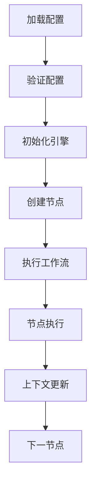
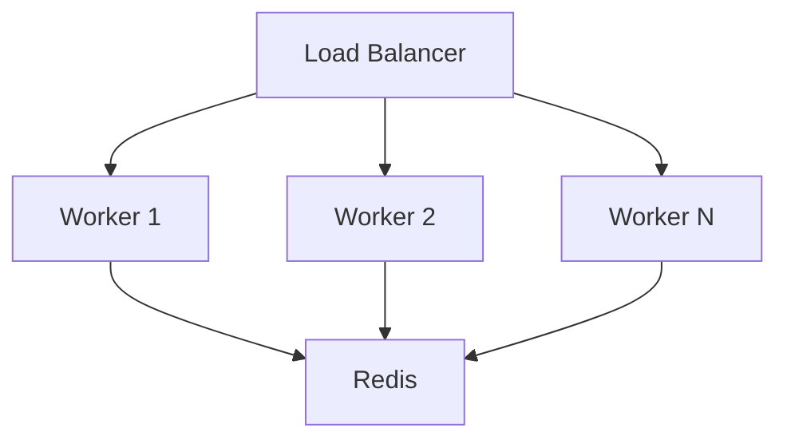

# AWF 软件架构设计文档

## 目录
1. [系统概述](#1-系统概述)
2. [架构总览](#2-架构总览)
3. [核心组件设计](#3-核心组件设计)
4. [数据流设计](#4-数据流设计)
5. [接口设计](#5-接口设计)
6. [扩展性设计](#6-扩展性设计)
7. [部署架构](#7-部署架构)
8. [安全设计](#8-安全设计)
9. [性能设计](#9-性能设计)
10. [示例与最佳实践](#10-示例与最佳实践)

## 1. 系统概述

### 1.1 设计目标
- 提供轻量级的 AI 工作流框架
- 支持通过 YAML 配置定义复杂的 AI 处理流程
- 实现模块化和可扩展的节点系统
- 支持多种 AI 提供商集成
- 提供简单直观的使用体验

### 1.2 系统范围
- YAML 配置系统
- 工作流执行引擎
- 节点类型系统
- Provider 集成系统
- CLI 工具
- 上下文管理
- 可视化支持

### 1.3 设计约束
- Python 3.8+ 运行环境
- 基于 YAML 的配置格式
- REST API 集成
- 异步处理支持
- 内存管理限制

### 1.4 关键技术选型
- 核心语言: Python 3.8+
- 配置格式: YAML
- 异步框架: asyncio
- HTTP 客户端: aiohttp
- CLI 框架: Click
- 配置解析: PyYAML
- 类型检查: Pydantic

## 2. 架构总览

### 2.1 架构原则
- 模块化设计
- 松耦合高内聚
- 可扩展性优先
- 配置驱动
- 简单易用
- 错误容忍

### 2.2 系统分层
```
┌───────────────────────┐
│        CLI 层         │ 命令行接口
├───────────────────────┤
│      配置管理层       │ YAML 解析和验证
├───────────────────────┤
│     工作流引擎层      │ 流程编排和执行
├───────────────────────┤
│      节点系统层       │ 节点定义和实现
├───────────────────────┤
│      Provider 层      │ AI 服务集成
└───────────────────────┘
```

### 2.3 核心概念
- Workflow: 工作流定义
- Node: 处理节点
- Edge: 节点连接
- Context: 上下文管理
- Provider: AI 服务提供商
- Engine: 工作流引擎 

## 3. 核心组件设计

### 3.1 工作流引擎 (Engine)
#### 3.1.1 职责
- 工作流配置加载和验证
- 节点实例化和生命周期管理
- 工作流执行和调度
- 上下文传递和管理
- 错误处理和恢复

#### 3.1.2 核心类设计
```python
class WorkflowEngine:
    def __init__(self, config: Dict[str, Any]):
        self.config = config
        self.nodes = {}
        self.context = Context()
        
    async def load(self):
        """加载并验证工作流配置"""
        
    async def execute(self, input_data: Any):
        """执行工作流"""
        
    async def _execute_node(self, node_id: str):
        """执行单个节点"""
```

### 3.2 节点系统 (Nodes)
#### 3.2.1 节点类型
- 流程控制节点 (f.*)
  - 输入/输出节点
  - 条件节点
  - 循环节点
  - 并行节点
- AI 处理节点 (ai.*)
  - 生成节点 (使用 Provider.generate)
  - 分类节点 (使用 Provider.classify)
  - 提取节点 (使用 Provider.extract)
- 工具节点 (util.*)
  - 日志节点 (日志记录)
  - HTTP节点 (API请求)
    - GET请求
    - POST请求
    - PUT请求
    - DELETE请求

#### 3.2.2 节点基类设计
```python
class BaseNode:
    def __init__(self, id: str, config: Dict[str, Any]):
        self.id = id
        self.config = config
        
    async def execute(self, context: Context) -> Any:
        """执行节点逻辑"""
        
    async def validate(self) -> bool:
        """验证节点配置"""
```

### 3.3 Provider 系统
#### 3.3.1 支持的提供商
- OpenAI
- Anthropic
- OpenRouter
- 自定义 Provider

#### 3.3.2 Provider 接口设计
```python
class BaseProvider:
    def __init__(self, config: Dict[str, Any]):
        self.config = config
        self.client = None
        
    async def initialize(self):
        """初始化 Provider"""
        
    async def generate(self, prompt: str, **kwargs) -> str:
        """生成内容"""
        
    async def classify(self, text: str, **kwargs) -> List[str]:
        """分类文本"""
```

### 3.4 上下文管理 (Context)
#### 3.4.1 功能特性
- 工作流状态管理
  - 当前执行节点
  - 执行历史
  - 执行状态
- 节点间数据传递
  - 上一节点输出
  - 全局变量
  - 临时变量
- 运行时信息
  - 开始时间
  - 执行时长
  - 资源使用

#### 3.4.2 上下文设计
```python
class Context:
    def __init__(self):
        # 工作流状态
        self.workflow_id: str = None
        self.current_node: str = None
        self.status: str = "init"  # init, running, completed, failed
        self.history: List[str] = []
        
        # 数据管理
        self.data: Dict[str, Any] = {}      # 节点间数据传递
        self.temp: Dict[str, Any] = {}      # 临时数据存储
        self.vars: Dict[str, Any] = {}      # 全局变量
        
        # 运行时信息
        self.start_time: float = time.time()
        self.metrics: Dict[str, Any] = {
            "duration": 0,
            "node_times": {},
            "memory_usage": 0
        }
        
    def get(self, key: str, default: Any = None) -> Any:
        """获取数据，优先级: temp > data > vars"""
        return self.temp.get(key) or self.data.get(key) or self.vars.get(key, default)
        
    def set(self, key: str, value: Any, scope: str = "data"):
        """设置数据到指定作用域"""
        if scope == "temp":
            self.temp[key] = value
        elif scope == "vars":
            self.vars[key] = value
        else:
            self.data[key] = value
            
    def update_metrics(self, node_id: str, duration: float):
        """更新节点执行指标"""
        self.metrics["node_times"][node_id] = duration
        self.metrics["duration"] = time.time() - self.start_time
```

### 3.5 配置管理
#### 3.5.1 配置结构
```yaml
version: "1.0"
name: "Workflow Name"

metadata:
  description: "..."
  author: "..."
  
nodes:
  - id: "node_id"
    type: "node_type"
    config: {}
    
edges:
  - source: "source_id"
    target: "target_id"
    type: "edge_type"
```

#### 3.5.2 配置验证器
```python
class ConfigValidator:
    def __init__(self, config: Dict[str, Any]):
        self.config = config
        
    def validate_workflow(self) -> bool:
        """验证工作流配置"""
        
    def validate_nodes(self) -> bool:
        """验证节点配置"""
        
    def validate_edges(self) -> bool:
        """验证边配置"""
```

## 4. 数据流设计

### 4.1 工作流执行流程


### 4.2 数据传递机制
- 通过上下文对象传递数据 (使用 Context.get/set)
- 节点间直接数据流 (通过 Context 中转)
- 临时数据存储 (使用 Context.temp)
- 全局配置访问 (使用 Context.config)

### 4.3 状态管理
- 工作流状态
- 节点状态
- 执行状态
- 错误状态

### 4.4 错误处理
- 节点级错误处理
- 工作流级错误恢复
- 重试机制
- 降级策略

## 5. 接口设计

### 5.1 核心 API
#### 5.1.1 工作流管理 API
```python
class WorkflowManager:
    async def create_workflow(self, config: Dict[str, Any]) -> str:
        """创建新工作流"""
        
    async def execute_workflow(self, workflow_id: str, input_data: Any) -> Any:
        """执行工作流"""
        
    async def get_workflow_status(self, workflow_id: str) -> Dict[str, Any]:
        """获取工作流状态"""
```

#### 5.1.2 节点管理 API
```python
class NodeManager:
    async def register_node(self, node_type: str, node_class: Type[BaseNode]):
        """注册新节点类型"""
        
    async def get_node_info(self, node_type: str) -> Dict[str, Any]:
        """获取节点信息"""
```

### 5.2 扩展接口
#### 5.2.1 Provider 接口
```python
class ProviderInterface(Protocol):
    async def initialize(self) -> None: ...
    async def generate(self, prompt: str, **kwargs) -> str: ...
    async def classify(self, text: str, **kwargs) -> List[str]: ...
```

#### 5.2.2 插件接口
```python
class PluginInterface(Protocol):
    def register(self, engine: WorkflowEngine) -> None: ...
    def initialize(self) -> None: ...
    def cleanup(self) -> None: ...
```

### 5.3 CLI 接口
```bash
# 基本命令
awf create <config_file>     # 创建工作流
awf run <workflow_id>        # 运行工作流
awf status <workflow_id>     # 查看状态
awf list                     # 列出工作流

# 开发工具
awf validate <config_file>   # 验证配置
awf debug <workflow_id>      # 调试模式
awf test <node_id>          # 测试节点

# 管理命令
awf plugin install <name>    # 安装插件
awf provider add <name>      # 添加提供商
```

## 6. 扩展性设计

### 6.1 节点扩展机制
#### 6.1.1 自定义节点示例
```python
@register_node("custom.mynode")
class MyCustomNode(BaseNode):
    async def execute(self, context: Context) -> Any:
        # 实现自定义逻辑
        return result
```

#### 6.1.2 节点注册系统
```python
class NodeRegistry:
    def __init__(self):
        self._nodes = {}
        
    def register(self, node_type: str, node_class: Type[BaseNode]):
        """注册节点类型"""
        
    def get_node_class(self, node_type: str) -> Type[BaseNode]:
        """获取节点类"""
```

### 6.2 Provider 扩展机制
#### 6.2.1 自定义 Provider 示例
```python
@register_provider("custom.provider")
class CustomProvider(BaseProvider):
    async def initialize(self):
        # 初始化逻辑
        
    async def generate(self, prompt: str, **kwargs) -> str:
        # 生成逻辑
```

#### 6.2.2 Provider 配置
```yaml
providers:
  custom.provider:
    api_key: ${CUSTOM_API_KEY}
    base_url: "https://api.custom.com"
    models:
      - "model-1"
      - "model-2"
```

### 6.3 插件系统
#### 6.3.1 插件结构
```
plugin_name/
├── __init__.py
├── nodes/
│   ├── __init__.py
│   └── custom_nodes.py
├── providers/
│   ├── __init__.py
│   └── custom_provider.py
└── plugin.yaml
```

#### 6.3.2 插件配置
```yaml
name: "my-plugin"
version: "1.0.0"
description: "Custom plugin"

nodes:
  - custom.node1
  - custom.node2

providers:
  - custom.provider1

dependencies:
  - package1>=1.0.0
  - package2>=2.0.0
```

## 7. 部署架构

### 7.1 部署模式
#### 7.1.1 单机部署


#### 7.1.2 分布式部署


### 7.2 依赖管理
```toml
[tool.poetry.dependencies]
python = "^3.8"
pyyaml = "^6.0"
aiohttp = "^3.8"
click = "^8.0"
pydantic = "^2.0"
redis = "^4.0"
```

### 7.3 配置管理
#### 7.3.1 环境变量
```bash
# .env
AWF_ENV=production
AWF_LOG_LEVEL=info
AWF_REDIS_URL=redis://localhost:6379
```

#### 7.3.2 配置优先级
1. 命令行参数
2. 环境变量
3. 配置文件
4. 默认值

### 7.4 监控与日志
#### 7.4.1 日志配置
```yaml
logging:
  level: info
  format: "%(asctime)s - %(name)s - %(levelname)s - %(message)s"
  handlers:
    - type: file
      filename: "awf.log"
    - type: console
```

#### 7.4.2 监控指标
- 工作流执行时间
- 节点执行时间
- 错误率
- 资源使用率
- API 调用统计

## 8. 安全设计

### 8.1 认证机制
#### 8.1.1 API 认证
```python
class AuthManager:
    def verify_token(self, token: str) -> bool:
        """验证 API 令牌"""
        
    def generate_token(self, user_id: str) -> str:
        """生成新令牌"""
```

#### 8.1.2 Provider 认证
- API 密钥管理
- 密钥轮换机制
- 访问权限控制

### 8.2 数据安全
#### 8.2.1 数据加密
- 传输加密 (TLS)
- 存储加密 (AES)
- 密钥管理

#### 8.2.2 数据隔离
- 工作流隔离
- 用户数据隔离
- Provider 数据隔离

### 8.3 访问控制
#### 8.3.1 RBAC 模型
```python
class RBACManager:
    def check_permission(self, user_id: str, resource: str, action: str) -> bool:
        """检查用户权限"""
```

#### 8.3.2 权限配置
```yaml
roles:
  admin:
    - workflow.create
    - workflow.execute
    - workflow.delete
  user:
    - workflow.execute
    - workflow.view
```

## 9. 性能设计

### 9.1 性能优化
#### 9.1.1 缓存策略
```python
class CacheManager:
    async def get(self, key: str) -> Any:
        """获取缓存数据"""
        
    async def set(self, key: str, value: Any, ttl: int = None):
        """设置缓存数据"""
```

#### 9.1.2 并发处理
- 异步执行
- 并行节点处理
- 资源池管理

### 9.2 扩展性能
- 水平扩展
- 负载均衡
- 队列处理

### 9.3 性能监控
- 响应时间
- 吞吐量
- 资源使用率
- 错误率

## 10. 示例与最佳实践

### 10.1 基础工作流示例
```yaml
version: "1.0"
name: "Basic AI Flow"

nodes:
  - id: "input"
    type: "f.input"
    
  - id: "ai_process"
    type: "ai.generate"
    config:
      provider: "openai"
      model: "gpt-4"
      
  - id: "output"
    type: "f.output"

edges:
  - source: "input"
    target: "ai_process"
  - source: "ai_process"
    target: "output"
```

### 10.2 最佳实践
#### 10.2.1 工作流设计
- 保持工作流简单清晰
- 适当使用错误处理
- 合理设置超时
- 使用有意义的节点ID

#### 10.2.2 性能优化
- 使用并行处理
- 合理设置缓存
- 避免不必要的API调用
- 监控资源使用

#### 10.2.3 安全建议
- 定期轮换密钥
- 最小权限原则
- 加密敏感数据
- 日志脱敏

### 10.3 故障排除
#### 10.3.1 常见问题
- 配置错误
- API限制
- 资源不足
- 网络问题

#### 10.3.2 调试工具
```bash
# 调试模式运行
awf run --debug workflow.yaml

# 查看详细日志
awf logs --level debug workflow_id

# 性能分析
awf profile workflow_id
```

## 附录

### A. 版本历史
- v1.0.0: 初始版本
- v1.1.0: 添加插件系统
- v1.2.0: 增加分布式支持
- v1.3.0: 安全性增强

### B. 参考资料
- Python AsyncIO 文档
- YAML 规范
- OpenAI API 文档
- Anthropic API 文档
- OpenRouter API 文档

## 项目目录结构
```
awf/
├── __init__.py
├── cli/                    # CLI 层
│   ├── __init__.py
│   ├── commands.py        # CLI 命令实现
│   └── main.py           # CLI 入口
│
├── config/                 # 配置管理层
│   ├── __init__.py
│   ├── loader.py         # YAML 配置加载
│   └── validator.py      # 配置验证
│
├── engine/                 # 工作流引擎层
│   ├── __init__.py
│   ├── engine.py         # 工作流引擎核心
│   ├── context.py        # 上下文管理
│   └── errors.py         # 错误处理
│
├── nodes/                  # 节点系统层
│   ├── __init__.py
│   ├── base.py           # 节点基类
│   ├── flow/             # 流程控制节点
│   │   ├── __init__.py
│   │   ├── input.py
│   │   ├── output.py
│   │   ├── condition.py
│   │   ├── loop.py
│   │   └── parallel.py
│   ├── ai/               # AI 处理节点
│   │   ├── __init__.py
│   │   ├── generate.py
│   │   ├── classify.py
│   │   └── extract.py
│   └── util/             # 工具节点
│       ├── __init__.py
│       ├── http.py
│       └── logger.py
│
├── providers/             # Provider 层
│   ├── __init__.py
│   ├── base.py          # Provider 基类
│   ├── openai.py
│   ├── anthropic.py
│   └── openrouter.py
│
├── utils/                 # 通用工具
│   ├── __init__.py
│   └── helpers.py
│
├── examples/              # 示例
│   ├── basic_flow.yaml
│   └── advanced_flow.yaml
│
├── tests/                 # 测试
│   ├── __init__.py
│   ├── test_engine.py
│   ├── test_nodes.py
│   └── test_providers.py
│
├── pyproject.toml        # 项目配置
├── README.md            # 项目说明
└── requirements.txt     # 依赖管理
```